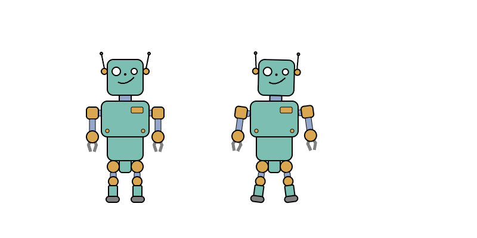

# webanimationtools

Some tools and proof-of-concept code for web bases animations.

See the README file of the different tools for details:

* [svg2apng](./svg2apng): convert an animated SVG file to an APNG file

